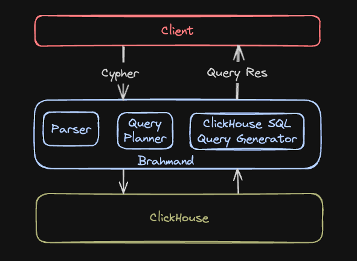

Brahmand runs as a stateless lightweight graph wrapper alongside ClickHouse:

1. **Client** sends a Cypher query to Brahmand.  
2. **Brahmand** parses & plans the query, translates to ClickHouse SQL.  
3. **ClickHouse** executes the SQL and returns results.  
4. **Brahmand** sends results back to the client.

---

