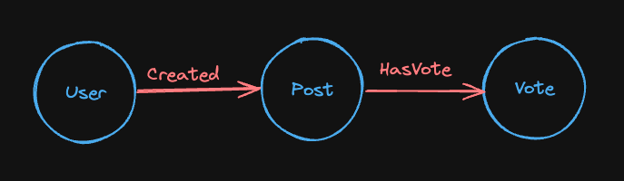

<!-- Brahmand uses numerous ClickHouse features to natively model graph data. 

> **Note:** We will use edges and relationships interchangibly throughout this documentation.

In a property graph, nodes and relationships/edges both have properties. 

Let's take this example - 



* 3 Nodes - User, Post, Vote
* 2 Relationships - Created, HasVote -->

Brahmand leverages ClickHouse’s powerful table engines to natively model property-graph data.

:::note
We use “edges” and “relationships” interchangeably throughout this documentation.
:::

In a property graph, both nodes and relationships (edges) can have properties. Consider this example:


- **Nodes:** `User`, `Post`, `Vote`  
- **Relationships:** `Created`, `HasVote`

Brahmand keeps separate tables for nodes and relationships

It uses two data structure to model the relationships.
1. Edge List
```js
Nodes: U = User, P = Post
Edges: U1 –[created]→ P1 
       U1 –[created]→ P3 
       U3 –[created]→ P2 

```
```js
|  U  |  P  |          
|-----|-----|
|  1  |  1  |
|  1  |  3  |
|  3  |  2  |

```
2. Adjacency list
```js
Nodes: U = User, P = Post
Edges: U1 –[created]→ P1 
       U1 –[created]→ P3 
       U3 –[created]→ P2

```
```js
|  U  |  P    |          
|-----|-------|
|  1  | [1,3] |
|  3  |   2   |

```

## Graph Modeling in Clickhouse

```json
Nodes:      Merge Family tables like MergeTree, ReplacingMergeTree
            Columns: (nodeId, props...)
            e.g (1, 'title', 'body')
```
```json
Edges:      Merge Family tables like MergeTree, ReplacingMergeTree for edge list 
            Columns: (from, to, props...)
            e.g (1, 3, props...)
```
```json
Edge-Index: AggregatingMergeTree table for adjacency list. 
            One for each direction.
            Columns: (from, to)
            e.g (1, [1,3])
```

```json
Materialized view: for each direction (outgoing and incoming) populates its 
                   corresponding Edge-Index table from the main Edge table, 
                   ensuring the index stays up to date.


```


---
