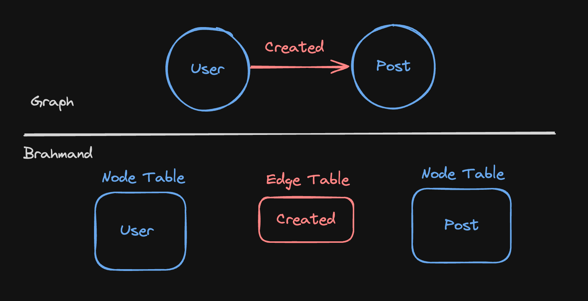

<!-- ---
title: How Brahmand model and store graph data? 
description: How Brahmand model and store graph data?
---


Let's take the same example with 
* 2 Nodes - User and Post 
* 1 Relationship - Created
  
 -->


Brahmand translates high-level Cypher DDL into ClickHouse tables and materialized views, optimizing both storage and traversal performance.

## Example


- **Nodes:** `User`, `Post`  
- **Relationship:** `Created`

## Cypher DDL
```cypher

CREATE NODE TABLE User(
    UserId UInt64,
    Reputation String,
    <!-- other columns -->
    NODE ID(UserId),
    PRIMARY KEY(Reputation, UserId)
);

CREATE NODE TABLE Post(
    PostID UInt64,
    PostTypeId Int8,
    <!-- other columns -->
    NODE id(PostID),
    PRIMARY KEY(PostTypeId, PostID)
);

CREATE REL TABLE CREATED(From User To Post);


```
## ClickHouse Translation

```sql
-- node User
CREATE TABLE User(
    userId UInt64,
    Reputation String,
    ...
) ENGINE = MergeTree
ORDER BY(Reputation, userId);

-- node Post
CREATE TABLE Post(
    postId UInt64,
    PostTypeId Int8,
    ...
) ENGINE = MergeTree
ORDER BY(PostTypeId, postId);

-- edge Created
CREATE TABLE CREAETED(
    from_user UInt64,
    to_post UInt64,
) ENGINE = MergeTree
ORDER BY(from_user, to_post);


-- edge index - Created outgoing direction
CREATE TABLE CREAETED_outgoing(
    from_id UInt64,
    to_id AggregateFunction(groupBitmap, UInt64)
) ENGINE = AggregatingMergeTree
ORDER BY from_id; 

-- MV for outgoing edge
CREATE MATERIALIZED VIEW mv_CREAETED_outgoing TO CREAETED_outgoing AS 
SELECT 
    from_user AS from_id,
    groupBitmapState(to_post) AS to_id
FROM CREAETED
GROUP BY from_id;


-- edge index - Created incoming direction
CREATE TABLE CREAETED_incoming(
    from_id UInt64,
    to_id AggregateFunction(groupBitmap, UInt64)
) ENGINE = AggregatingMergeTree
ORDER BY from_id; 


-- MV for incoming edge
CREATE MATERIALIZED VIEW mv_CREAETED_incoming TO CREAETED_incoming AS 
SELECT 
    to_post AS from_id,
    groupBitmapState(from_user) AS to_id
FROM CREAETED
GROUP BY from_id;


```

## Bi-directional Indexes
By maintaining both outgoing and incoming edge indexes, BrahmandDB supports efficient bi-directional traversals without additional query-time joins.

## Bitmap-Based Edge Index Storage

Edges are stored using ClickHouse’s Roaring Bitmap (via AggregateFunction(groupBitmap, UInt64)), offering:

* High compression of large integer sets

* Fast set operations for union/intersection during traversals

This combination of MergeTree tables, AggregatingMergeTree edge indexes, and materialized views delivers both storage efficiency and traversal speed at analytical scale.

<!-- Another important thing is we are storing the edge list in bitmaps. ClickHouse uses Roaring Bitmaps under the hood which are very efficient in storing large number of integers and it is optimized for set operations. This is crucial optimization for graph traversals. -->