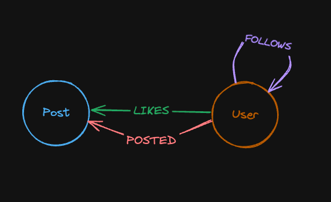

:::note
This tutorial assumes **brahmand** is running via the Docker Compose configuration provided on the [installation page](/get_started/install).
:::

Brahmand implements a **structured property graph** model and requires a pre-defined schema. 
> ClickHouse provides built-in JSON data type today, and upcoming enhancements will enable full semi-structured schemas—letting you store, index, and query JSON documents directly in your graph.

* Schema definition involves declaring node and relationship tables and their associated properties.
* Each property key is strongly typed (types must be explicitly declared)
* For node tables, a `primary key` and a `node id` must be defined
* For relationship tables, `primary key` is optional

---
## Example database
The dataset used in the tutorials is a social network dataset of users and posts that has the following schema. 
> This [dataset](https://docs.kuzudb.com/tutorials/example-database/) originates from [KuzuDB](https://kuzudb.com/), and brahmand draws significant inspiration from Kuzu.



## Nodes

### User
The User node represents users within the social network. Each user has their information attached, such as:
* **user_id (UInt64)**: This is an id which is used to sort and find users.
* **username (String)**: This is the username which each user will have.
* **account_creation_date (DateTime)**: This represents the date which the account was created.

```csv
userId,username,account_creation_date
1,Frodo,2025-09-09
2,Sam,2025-01-27
3,Aragon,2025-02-25
4,Gandolf,2025-05-11
5,Sauron,2025-06-11
6,Saruman,2025-03-11
```

### Post
The Post node represents the posts which has been made on the social network. Each post has its information attached, such as:
* **post_id (UInt64)**: This is an unique id which is used to sort and find posts.
* **creation_date (DateTime)**: This represents the date which the account was created.
* **like_count (UInt64)**: This represents the amount of likes the post has received.
* **retweet_count (UInt64)**: This represents the amount of retweets the post has received.

```csv
postId,creation_date,like_count,retweet_count
1,2021-12-08,427,29
2,2022-06-02,9,16
3,2023-01-14,238,51
4,2023-01-06,67,147
5,2022-10-26,103,73
```

## Relationships

### FOLLOWS
The relationship `FOLLOWS` goes from `User` node to `User` node. This relation represents a user following another user on the social network.
```csv
from_User,to_User
1,3
1,4
2,1
2,3
2,4
6,5
```
:::note
In your relationships CSV, include `from_<NodeLabel>` and `to_<NodeLabel>` columns—brahmand uses these fields to define edges between nodes.
:::

### POSTS
The relationship `POSTS` goes from `User` node to `Post` node. This relation represents a user posting the post on the social network.
```csv
from_User,to_Post
1,1
4,2
5,3
3,4
2,5
```
### LIKES
The relationship `Likes` goes from `User` node to `Post` node. This relation represents a user liking the post on the social network.
```csv
from_User,to_Post
1,1
2,1
3,1
3,2
4,2
```

## Define the schema in Brahmand
We will use brahmand-client CLI in this tutorial.

In the brahmand-client CLI, let’s create a node table for the `User`s in our dataset.
> **For `NODE ID` brahmand only supports `UInt64` and `Int64`**.

```cypher
CREATE NODE TABLE User(
    userId UInt64,
    username String,
    account_creation_date DateTime,
    NODE ID(userId),
    PRIMARY KEY(username,userId)
);
```
```
DDL applied successfully
```


We can do a similar thing for the `Post`s in our dataset.
```cypher
CREATE NODE TABLE Post(
    postId UInt64,
    creation_date DateTime,
    like_count UInt64,
    retweet_count UInt64,
    NODE ID(postId),
    PRIMARY KEY(postId)
);
```
```
DDL applied successfully
```
Now that we have our node tables, we can create a relationship table for the `FOLLOWS`, `POSTS` and `LIKES` relationships in our dataset.

```cypher
CREATE REL TABLE FOLLOWS(From User To User);
```
```
DDL applied successfully
```
```cypher
CREATE REL TABLE POSTS(From User To Post);
```
```
DDL applied successfully
```
```cypher
CREATE REL TABLE LIKES(From User To Post);
```
```
DDL applied successfully
```

## Check ClickHouse Tables

Considering you are running brahmand with the docker compose configuration, to launch ClickHouse client, use this following command - 
```bash
docker compose exec clickhouse-service clickhouse-client \
  --host clickhouse-service \
  --port 9000 \
  --user test_user \
  --password test_pass \
  --database brahmand

```
To check tables and materialized views created by Brahmand, run:
```SQL
SHOW TABLES;
```
```
    ┌─name────────────────┐
 1. │ FOLLOWS             │
 2. │ FOLLOWS_incoming    │
 3. │ FOLLOWS_outgoing    │
 4. │ LIKES               │
 5. │ LIKES_incoming      │
 6. │ LIKES_outgoing      │
 7. │ POSTS               │
 8. │ POSTS_incoming      │
 9. │ POSTS_outgoing      │
10. │ Post                │
11. │ User                │
12. │ graph_meta          │
13. │ mv_FOLLOWS_incoming │
14. │ mv_FOLLOWS_outgoing │
15. │ mv_LIKES_incoming   │
16. │ mv_LIKES_outgoing   │
17. │ mv_POSTS_incoming   │
18. │ mv_POSTS_outgoing   │
    └─────────────────────┘

```